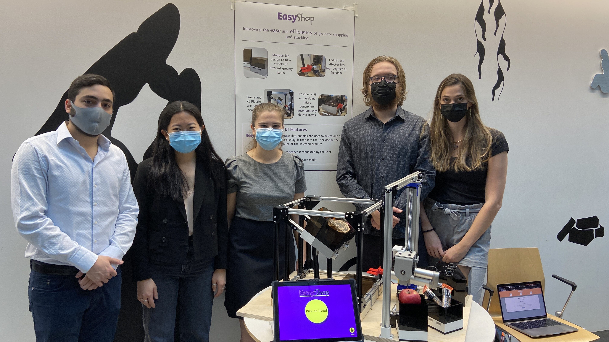

# FALL 2021 Senior Design Project 
## **EasyShop!**
### **Team Members:** Daniel Ryaboshapka, Taylor Korte, Rebecca Shen, Stephanie Bentley
### Amazon Robotics Sponsored Project
## **Problem Statement:** *Reduce the difficulty of stocking and picking grocery items in an aisle*

---

---

# Table Of Contents
0. [Project Description](#project-description)
1. [Page Layout](#page-layout)
2. [Planning Phase](#check-out-the-planning-phase)
3. [Design Phase](#design-phase)
4. [Iteration](#iteration)
5. [Code & Electronics](#code-&-electronics)
6. [Demo](#demo)

# Project Description
For our Senior Design class, we set out attempting to assist in the general automation of the grocery shopping experience. Through careful design iteration and concept generation, we found a solution that we could implement in a month in order to generate a MVP during a demo presentation on Monday, December 6th. Our product, EasyShop, is a fully modular and easily scale-able vending machine that can hold various fresh produce and healthy options inside or outside of a grocery store. 

# Page Layout
This repository is split up into two sections: code and team documents. The code exists in the root location, with JS, CSS, and images in `static` and HTML in `templates`. The code is split into multiple python scripts, along with a flask server app (within `app.py`). The `planning` and `presentations` folders contain seperate README files that explain the inner workings of each file, as well as how the team utilized each file when working on the project. 
## `planning` 
In this folder, there exists `.pdf` and original file-type versions of each document created during our planning phase
## `presentations`
Here lie `.pdf` versions of our presentations presented to our classmates, Amazon sponsors, and instructors
## `static`
This folder contains three subfolders: `css`, `js`, and `images` which are used within the server to host stylesheets, internal scripts, and images
## `templates`
This holds various `html` files which the server renders
# [Check out the Planning Phase](https://github.com/drybell/Senior_Design/tree/master/planning)
# Design Phase
# Iteration
# Code & Electronics
# Demo
