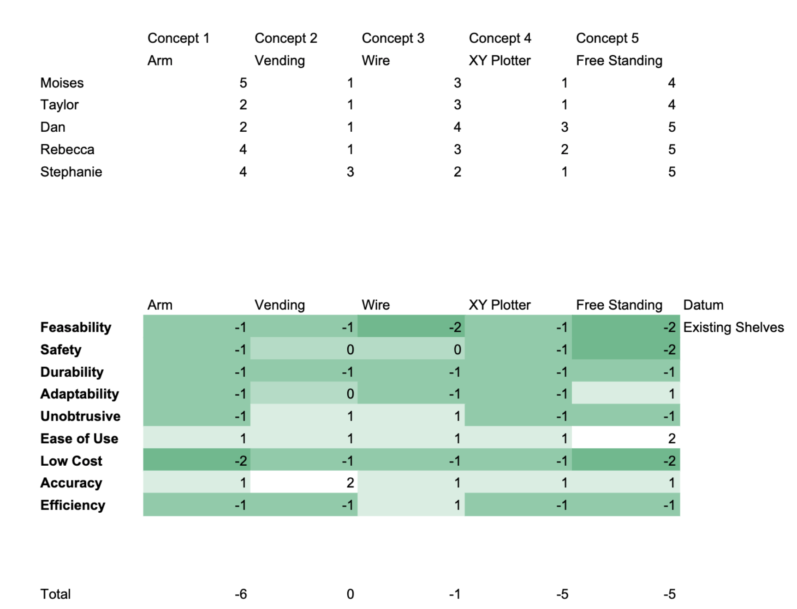
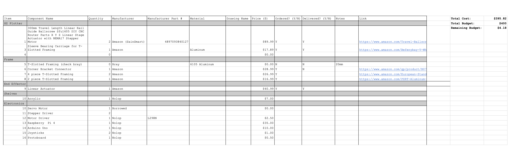

# Design Phase 

## Individual CAD Models
After working through our planning and concept generation phase, we pivoted towards actual CAD design and condensing our ideas down to a few to present to our sponsors. We came up with an attachable arm that translates through an aisle, a stand-alone vending machine, a wire-hanging gondola system, and an XZ Plotter attached to the aisle. [Here is the link to the presentation.](https://docs.google.com/presentation/d/10bg_C8RxaWk_3B0-rSAKrKcWvw39FXTsYiPgkwq6Xnk/edit?usp=sharing)

### Concept 1: Attachable Arm

### Concept 2: Vending Machine

### Concept 3: Wire System

### Concept 4: XY Plotter

## Finalizing Product Design

The final activity done during our set-based design was a Pugh Chart and final ranking poll in order to finalize our concepts and determine which individual idea was the best to implement during our fabrication phase.

## Initial Prototype and Demo

## Further Testing and Iteration

## Bill Of Materials
*(View BOM.pdf or BOM.xlsx for more details)*

After finalizing our design, we constructed a bill of materials in order to track parts and manage our $400 budget. 