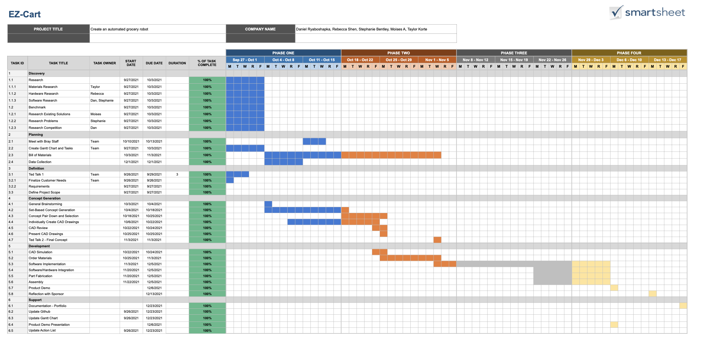
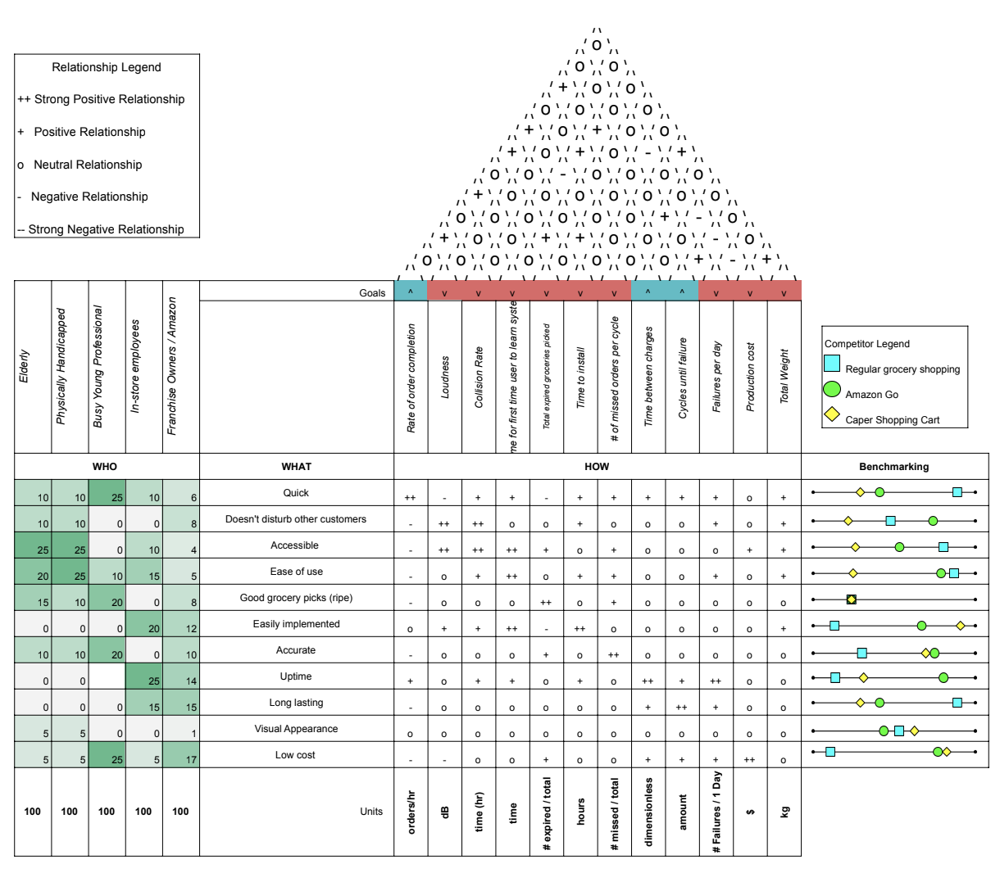
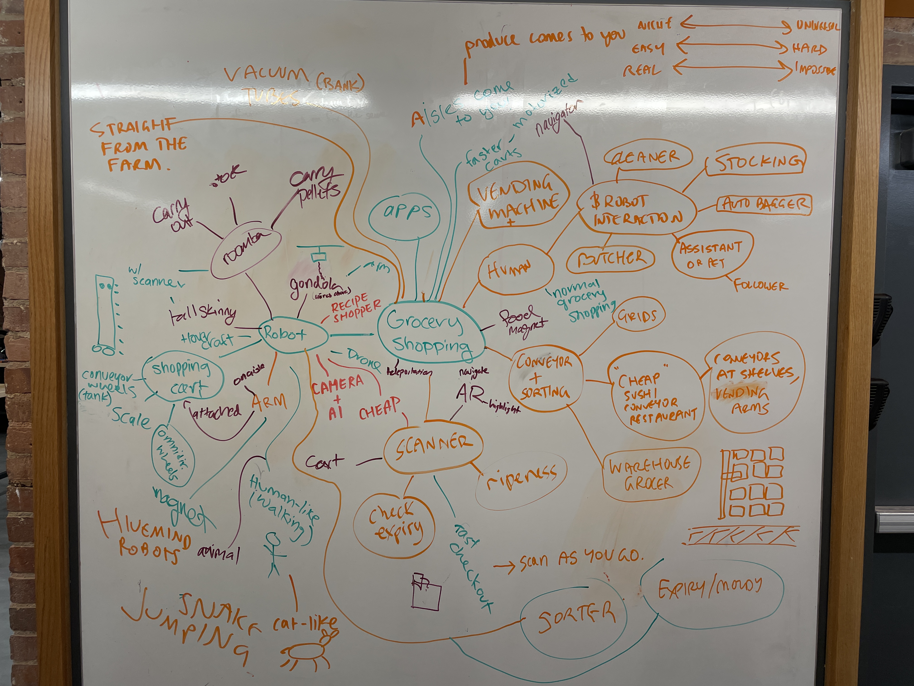
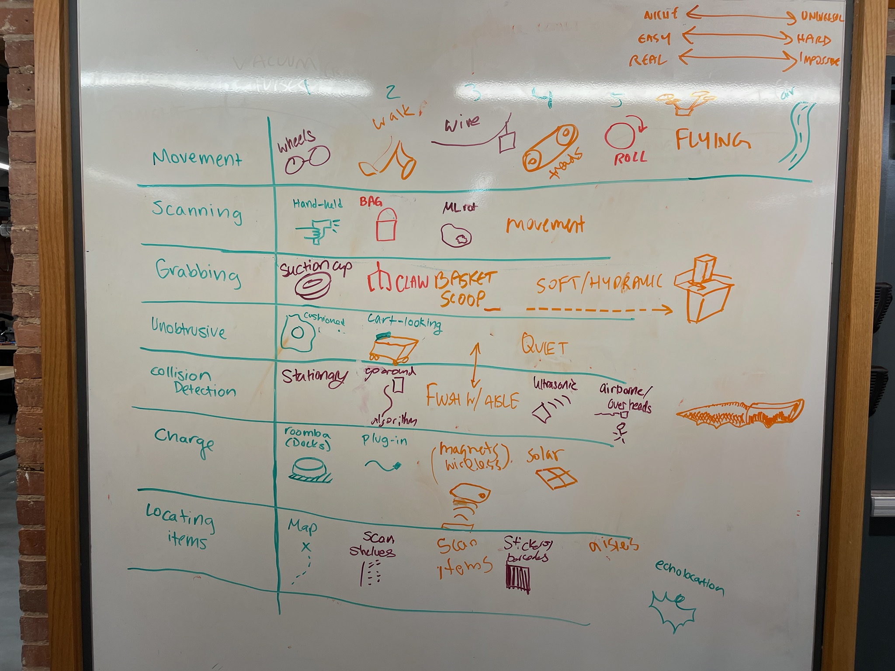
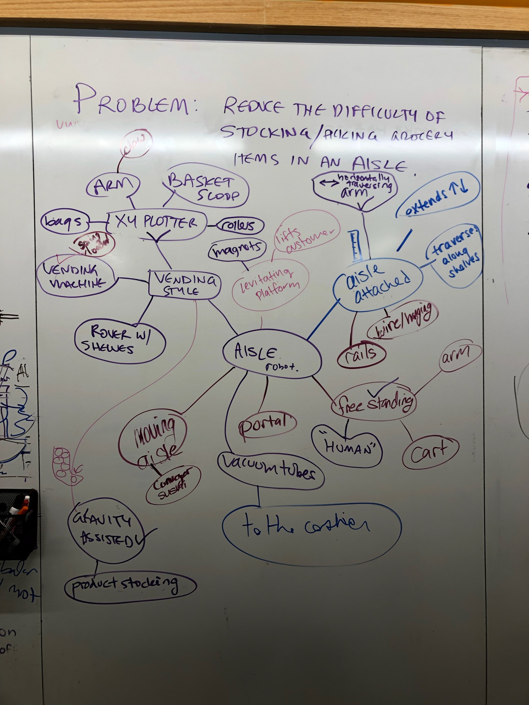

# Planning & Set Based Design

## Gantt Chart
*(View Gantt Chart.pdf or Gantt Chart.xlsx for more details)*

We began our design and planning process by starting off with a quick Gantt Chart in order to split up our semester into sections and allot enough time for every aspect of our project. A lot of time was allocated towards project planning and set-based design. As the semester progressed, more time is alloted to fabrication, iteration, and software implementation. The four phases were split up into *Planning/Research*, *Design*, *Fabrication*, and *Testing/Demo*.

## Spec Sheet
*(View Spec Sheet.pdf for more details)*

After finalizing our plan for the semester, we transitioned to a House of Quality, or Specification Sheet given some of our stakeholder requirements and needs. We focused on ease-of-use and accuracy for product requirements and split potential stakeholders into grocery store owners, in-store employees, busy professionals, and physically handicapped individuals. The House of Quality allowed us to identify trends in what the general population would require from our product. 

## Set A Design

We started off our set-based design by doing a mind map activity centered on three spectrums: *Niche* to *Universal* application, *Realistic* to *Impossible* implementation, and *Easy* to *Hard* fabrication. Our mind map contained a creative and diverse solution set, and assisted in understanding the physical bounds of our design. Some ideas ranged from *Roomba-esque* robots to focusing on a scanner that checked for ripeness. We also had the vending machine that we ultimately settled on as our product during this stage of concept generation.

## Set B Design

Given our expansive Mind Map from Set A, we shifted to a Morphology Chart in order to find more subtle and direct approaches to simple problems like *grabbing* or *scanning*. This type of concept generation allowed us to mix and match designs in order to come up with creative solutions. We split up our product priorities into *movement*, *scanning*, *grabbing*, *unobtrusiveness*, *collision detection*, *charge ability*, and *locating items*. This specification list has changed drastically throughout our design process, but initially we were hoping for our product to roam through the grocery store freely and assist customers.  

## Final Round of Design 
*(View Set Z Planning Design.pdf or .xslx for more details)*

After meeting with Bray Lab staff about our project, they noticed how broad our original problem statement was, and helped narrow our scope to something manageable given a one month fabrication and testing time period. We pivoted from an original problem statement that focused on the general automation of the grocery store to an in-aisle automation solution. After wrapping up this mind map, we came up with 5 individual solutions by mixing and matching the different entries from our various set-based design. The 5 individual designs and CAD models will be discussed in the [design section](https://github.com/drybell/Senior_Design/tree/master/design)

