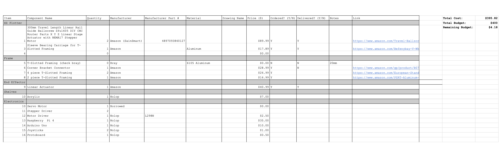

# Planning & Set Based Design

## Gantt Chart
*(View Gantt Chart.pdf or Gantt Chart.xlsx for more details)*

We began our design and planning process by starting off with a quick Gantt Chart in order to split up our semester into sections and allot enough time for every aspect of our project. 

## Set A Design

We started off our set-based design by doing a mind map activity centered on three spectrums: *Niche* to *Universal* application, *Realistic* to *Impossible* implementation, and *Easy* to *Hard* fabrication. 

## Set B Design

Given our expansive Mind Map from Set A, we shifted to a Morphology Chart in order to find more subtle and creative approaches to simple problems like *grabbing* or *scanning*. This type of concept generation allowed us to mix and match designs that we thought would never work. 

## Final Round of Design 

After meeting with Bray Lab staff about our problem, they noticed how broad our original problem statement was, 

## Bill Of Materials
*(View BOM.pdf or BOM.xlsx for more details)*

After finalizing our design, we constructed a bill of materials in order to track parts and manage our $400 budget. 

